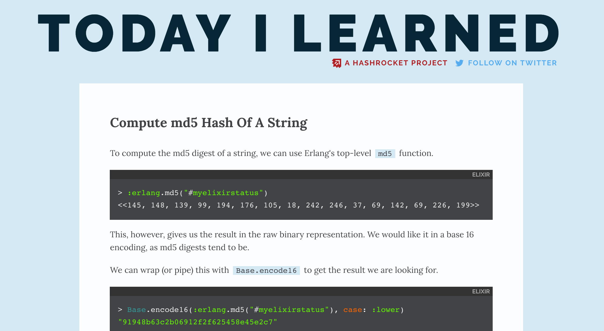

footer: Embrace the Database with Ecto (2/15/2017) - Josh Branchaud - @jbrancha - Hashrocket
slidenumbers: true

# _Embrace_ The _Database_

## with **Ecto**

---

# About me

- Josh Branchaud
- Software Developer at **Hashrocket**

---

I have some opinions about databases.

---

<!-- NOTES: one thing to take away from this talk -->

### The **Database** Is Your

# *Friend*

<!-- NOTES: it's not a scary black box, or at least it doesn't have to be -->

---

### ... but databases are scary!

- Composite Indexes
- Full Outer Joins
- Common Table Expressions
- Explain Analyze Output

---

<!-- TODO: I want to say this, but where does it fit in the talk -->

### your database is not just a

### _dumb data store_

---

## it is a _powerful_ **computation engine**

---

The **data** stored in your _database_ is the single most important _asset_ in the life of your product/business.

---

The best database for web application is...

---

# `PostgreSQL`

---

# Agenda

- Data Integrity
- Schemaless Queries
- Ecto's Escape Hatch
- Enhancing Ecto with Custom Functions

---

<!-- NOTES: but first, we need some data to work with -->

# Our Sample Data Source



---

# What is TIL?

TIL is an open-source project by the team at
[**Hashrocket**](https://hashrocket.com/) that catalogues the sharing &
accumulation of knowledge as it happens day-to-day. 

(Check it out - [til.hashrocket.com](til.hashrocket.com))

---

<!-- TODO: include a right-half image of a UML-type diagram -->

# TIL's DB Schema

- Posts
- Developers
- Channels

---

<!-- TODO: how do these code blocks of DDL description look? -->

# Posts Table

```sql
> \d posts
                                      Table "public.posts"
    Column    |            Type             |                     Modifiers
--------------+-----------------------------+----------------------------------------------------
 id           | integer                     | not null default nextval('posts_id_seq'::regclass)
 developer_id | integer                     | not null
 body         | text                        | not null
 created_at   | timestamp without time zone | not null
 updated_at   | timestamp without time zone | not null
 channel_id   | integer                     | not null
 title        | character varying           | not null
 slug         | character varying           | not null
 likes        | integer                     | not null default 1
 tweeted      | boolean                     | not null default false
 published_at | timestamp with time zone    |
 max_likes    | integer                     | not null default 1
Indexes:
    "posts_pkey" PRIMARY KEY, btree (id)
    "index_posts_on_channel_id" btree (channel_id)
    "index_posts_on_developer_id" btree (developer_id)
Check constraints:
    "likes" CHECK (likes >= 0)
Foreign-key constraints:
    "fk_rails_447dc2e0a3" FOREIGN KEY (channel_id) REFERENCES channels(id)
    "fk_rails_b3ec63b3ac" FOREIGN KEY (developer_id) REFERENCES developers(id)
```

---

# Developers Table

```sql
> \d developers
                                       Table "public.developers"
     Column     |            Type             |                        Modifiers
----------------+-----------------------------+---------------------------------------------------------
 id             | integer                     | not null default nextval('developers_id_seq'::regclass)
 email          | character varying           | not null
 username       | character varying           | not null
 created_at     | timestamp without time zone | not null
 updated_at     | timestamp without time zone | not null
 twitter_handle | character varying           |
 admin          | boolean                     | not null default false
 editor         | character varying           | default 'Text Field'::character varying
 slack_name     | character varying           |
Indexes:
    "developers_pkey" PRIMARY KEY, btree (id)
Referenced by:
    TABLE "posts" CONSTRAINT "fk_rails_b3ec63b3ac" FOREIGN KEY (developer_id) REFERENCES developers(id)
```

---

# Channels Table

```sql
> \d channels
                                        Table "public.channels"
     Column      |            Type             |                       Modifiers
-----------------+-----------------------------+-------------------------------------------------------
 id              | integer                     | not null default nextval('channels_id_seq'::regclass)
 name            | text                        | not null
 created_at      | timestamp without time zone | not null
 updated_at      | timestamp without time zone | not null
 twitter_hashtag | character varying(20)       | not null
Indexes:
    "channels_pkey" PRIMARY KEY, btree (id)
Check constraints:
    "twitter_hashtag_alphanumeric_constraint" CHECK (twitter_hashtag::text ~ '^[\w\d]+$'::text)
Referenced by:
    TABLE "posts" CONSTRAINT "fk_rails_447dc2e0a3" FOREIGN KEY (channel_id) REFERENCES channels(id)
```

---

# Data

> So many answers just waiting to be asked the right question

---

# Asking Questions

How do we ask questions of our data?

---

# We need a mediator

<!-- NOTE: good analogy here is that your database is a library and the
mediator between you and the library is a librarian. You can ask them
questions and they will help find things and figure it out. The duey decimal
system is analogous to databases indices. -->

What is the best mediator between us and our data?

<!-- NOTE: I'm here to tell you about the best DSL for interacting with a SQL database! -->

---

# SQL

SQL is the best way to talk to our SQL database

---

# How many posts are there?

```sql
sql> select count(*) from posts;
 count
-------
  1066
(1 row)
```

---

# What about Elixir and Ecto?

---

<!-- NOTES: this is an Elixir meetup, so we should probably talk about
Elixir and Ecto -->

# Ecto

> Ecto is a domain specific language for writing queries and interacting with databases in Elixir.

<!-- NOTES: also, Ecto is a really badass DSL for interacting with databases -->
<!-- NOTES: there is a lot we can accomplish from the comfort of the data-centric,
  functional accommodations that Elixir provides us. -->

---

### How many posts are there?

```elixir
iex> Repo.one(from p in "posts", select: count(p.id))
1066

17:16:36.573 [debug] QUERY OK source="posts" db=10.8ms queue=0.2ms
SELECT count(p0."id") FROM "posts" AS p0 []
```

---

## Queries Are Just

# Data

---

# Queries As Data

- #Ecto.Query Struct
- You build them up as you go
- You can inspect them

---

# Data Integrity

Your database is the ultimate **gatekeeper**

- Many clients, microservices
- App-level validations vs DB-level validations
- DRY it up!

<!--
You should be relying primarily on the database to validate your data.
Any application-level validations are for the application to do its job
(e.g. provide good validation errors, prevent unnecessary trips to DB,
etc.). You may have multiple application clients (phoenix, iphone, android)
that interface with your DB. DRY up the most essential layer of data
validation by putting it in your database.
-->

---

# Data Integrity

- Enforce particular datatype 
    - Using better, custom data types (e.g. uuid, bigint, and citext)

```elixir
execute("create extension if not exists citext;")

create table(:developers, primary_key: false) do
  add :id, :uuid, primary_key: true
  add :email, :citext
end
```

---

# Data Integrity

- Enforce Presence
    - Not Null Constraints

```elixir
execute("create extension if not exists citext;")

create table(:developers, primary_key: false) do
  add :id, :uuid, primary_key: true
  add :email, :citext, null: false
end
```

---

# Data Integrity

- Enforce Relationships
    - Foreign Key Constraints

```elixir
create table(:posts) do
  add :title, :varchar, null: false
  add :body, :text, null: false

  add :developer_id, references(:developers, type: :uuid)
end
```

---

# Data Integrity

- Enforce More General Relationships
    - Check Constraints

```elixir
create table(:posts) do
  add :title, :varchar, null: false
  add :body, :text, null: false
  add :likes, :smallint, null: false, default: 0

  add :developer_id, references(:developers, type: :uuid)
end

create constraint(:posts, "ensure_positive_likes", check: "likes >= 0")
```

<!-- TODO: can we have examples of each of these? -->

---

# Data Integrity

```elixir
def up do
  execute("create extension if not exists citext;")
  execute("create extension if not exists pgcrypto;")

  create table(:developers, primary_key: false) do
    add :id, :uuid, primary_key: true, default: fragment("gen_random_uuid()")
    add :email, :citext, null: false
    add :created_at, :timestamptz, null: false, default: fragment("now()")
    add :updated_at, :timestamptz, null: false, default: fragment("now()")
  end

  create table(:posts) do
    add :title, :varchar, null: false
    add :body, :text, null: false
    add :likes, :smallint, null: false, default: 0

    add :developer_id, references(:developers, type: :uuid)

    add :created_at, :timestamptz, null: false, default: fragment("now()")
    add :updated_at, :timestamptz, null: false, default: fragment("now()")
  end

  create constraint(:posts, "ensure_positive_likes", check: "likes >= 0")
end
```

---

# Data Integrity

```elixir
def down do
  drop table(:posts)
  drop table(:developers)

  execute("drop extension if exists pgcrypto;")
  execute("drop extension if exists citext;")
end
```

---

# Schemaless Queries

```elixir
iex> Repo.one(from p in "posts", select: count(p.id))
```

- Always start with a `from` clause
- `Repo.one`, `Repo.all`, etc. to execute
- `import Ecto.Query` and `alias MyApp.Repo`

---

# How many developers are there?

```elixir
iex> Repo.one(from d in "developers", select: fragment("count(*)"))

17:19:01.195 [debug] QUERY OK source="developers" db=1.0ms queue=2.9ms
SELECT count(*) FROM "developers" AS d0 []

32
```

---

# How many posts by channel?

First, let's join `channels` on `posts`

```elixir
iex> posts_and_channels = from(p in "posts",
    join: c in "channels",
    on: p.channel_id == c.id)

#Ecto.Query<from p in "posts", join: c in "channels", on: p.channel_id == c.id>
```

---

# How many posts by channel?

Use `group_by` with `count(p.id)` as our aggregator

```elixir
iex> Repo.all(from([p,c] in posts_and_channels,
    group_by: c.name,
    select: {count(p.id), c.name}))

16:12:31.539 [debug] QUERY OK source="posts" db=6.8ms
SELECT count(p0."id"), c1."name" FROM "posts" AS p0 INNER JOIN "channels" AS c1 ON p0."channel_id" = c1."id" GROUP BY c1."name" []

[{13, "clojure"}, {5, "react"}, {102, "rails"}, {201, "vim"}, {59, "workflow"},
 {110, "command-line"}, {121, "sql"}, {73, "elixir"}, {1, "erlang"},
 {6, "design"}, {28, "testing"}, {5, "go"}, {15, "mobile"}, {67, "javascript"},
 {32, "devops"}, {125, "ruby"}, {17, "html-css"}, {63, "git"}, {23, "emberjs"}]
```

---

# How many posts by channel?

Clean up the result with an `order_by` clause

```elixir
> Repo.all(from([p,c] in posts_and_channels,
    group_by: c.name,
    order_by: [desc: count(p.id)],
    select: {count(p.id), c.name}))

16:13:43.516 [debug] QUERY OK source="posts" db=7.3ms
SELECT count(p0."id"), c1."name" FROM "posts" AS p0 INNER JOIN "channels" AS c1 ON p0."channel_id" = c1."id" GROUP BY c1."name" ORDER BY count(p0."id") DESC []

[{201, "vim"}, {125, "ruby"}, {121, "sql"}, {110, "command-line"},
 {102, "rails"}, {73, "elixir"}, {67, "javascript"}, {63, "git"},
 {59, "workflow"}, {32, "devops"}, {28, "testing"}, {23, "emberjs"},
 {17, "html-css"}, {15, "mobile"}, {13, "clojure"}, {6, "design"}, {5, "go"},
 {5, "react"}, {1, "erlang"}]
```

---

# How many posts on average per developer?

First, let's get post counts for each developer

```elixir
iex> post_counts = from(p in "posts",
                 group_by: p.developer_id,
                 select: %{post_count: count(p.id), developer_id: p.developer_id})

#Ecto.Query<from p in "posts", group_by: [p.developer_id],
 select: %{post_count: count(p.id), developer_id: p.developer_id}>
```

---

# How many posts on average per developer?

```elixir
iex> Repo.all(post_counts)

10:29:09.177 [debug] QUERY OK source="posts" db=5.8ms
SELECT count(p0."id"), p0."developer_id" FROM "posts" AS p0 GROUP BY p0."developer_id" []
[%{developer_id: 14, post_count: 6}, %{developer_id: 25, post_count: 43},
 %{developer_id: 32, post_count: 1}, %{developer_id: 27, post_count: 2},
 %{developer_id: 8, post_count: 332}, %{developer_id: 17, post_count: 1},
 %{developer_id: 15, post_count: 23}, %{developer_id: 1, post_count: 1},
 %{developer_id: 10, post_count: 18}, %{developer_id: 26, post_count: 78},
 %{developer_id: 11, post_count: 15}, %{developer_id: 4, post_count: 130},
 %{developer_id: 18, post_count: 14}, %{developer_id: 30, post_count: 10},
 %{developer_id: 16, post_count: 3}, %{developer_id: 33, post_count: 1},
 %{developer_id: 6, post_count: 3}, %{developer_id: 19, post_count: 9},
 %{developer_id: 29, post_count: 82}, %{developer_id: 2, post_count: 236},
 %{developer_id: 23, post_count: 10}, %{developer_id: 31, post_count: 5},
 %{developer_id: 20, post_count: 8}, %{developer_id: 5, post_count: 3},
 %{developer_id: 13, post_count: 3}, %{developer_id: 22, post_count: 12},
 %{developer_id: 9, post_count: 10}, %{developer_id: 24, post_count: 4},
 %{developer_id: 7, post_count: 3}]
```

---

# How many posts on average per developer?

```elixir
iex> Repo.aggregate(subquery(post_counts), :avg, :post_count)

10:29:45.425 [debug] QUERY OK db=13.0ms queue=0.1ms
SELECT avg(s0."post_count") FROM (SELECT count(p0."id") AS "post_count",
p0."developer_id" AS "developer_id" FROM "posts" AS p0 GROUP BY
p0."developer_id") AS s0 []

#Decimal<36.7586206896551724>
```

---

# `Ecto.Repo.aggregate`

`:avg | :count | :max | :min | :sum`

```elixir
iex> Repo.aggregate("posts", :count, :id)

10:02:11.862 [debug] QUERY OK source="posts" db=21.8ms
SELECT count(p0."id") FROM "posts" AS p0 []

1066
```

<!--
---

# Scrubbing Data

Remove personal and sensitive information

Especially, for **production** data!
-->

---

# Schemaless Queries

Let's try something a bit more complex

> What is the channel and title of each developer's most liked post in 2016?

---

# Complex Queries

> Writing complex queries is all about building the solution from the ground up.

piece by piece.

---

#### What is the channel and title of each developer's most liked post in 2016?

First, let's join our tables together

```elixir
iex> posts_devs_channels = from(p in "posts",
     join: d in "developers", on: d.id == p.developer_id,
     join: c in "channels", on: c.id == p.channel_id)

#Ecto.Query<from p in "posts", join: d in "developers",
 on: d.id == p.developer_id, join: c in "channels", on: c.id == p.channel_id>
```

---

#### What is the channel and title of each developer's most liked post in 2016?

Next, we can combine `order_by` and `distinct`

```elixir
iex> from([posts, devs, channels] in posts_devs_channels(),
     distinct: devs.id,
     order_by: [desc: posts.likes],
     select: %{
       dev: devs.username,
       channel: channels.name,
       title: posts.title
     }
)

#Ecto.Query<from p in "posts", join: d in "developers", on: true,
 join: c in "channels", on: d.id == p.developer_id and c.id == p.channel_id,
 order_by: [desc: p.likes], distinct: [asc: d.id],
 select: %{dev: d.username, channel: c.name, title: p.title}>
```

---

#### What is the channel and title of each developer's most liked post in 2016?

Now, let's constrain the results to 2016

```elixir
iex> top_of_2016 = from([posts, devs, channels] in posts_devs_channels(),
     distinct: devs.id,
     order_by: [desc: posts.likes],
     where: posts.created_at > ^Ecto.DateTime.cast!({{2016,1,1},{0,0,0}}),
     where: posts.created_at < ^Ecto.DateTime.cast!({{2017,1,1},{0,0,0}}),
     select: %{
       dev: devs.username,
       channel: channels.name,
       title: posts.title
     }
)

#Ecto.Query<from p in "posts", join: d in "developers",
 on: d.id == p.developer_id, join: c in "channels", on: c.id == p.channel_id,
 where: p.created_at > ^#Ecto.DateTime<2016-01-01 00:00:00>,
 where: p.created_at < ^#Ecto.DateTime<2017-01-01 00:00:00>,
 order_by: [desc: p.likes], distinct: [asc: d.id],
 select: %{dev: d.username, channel: c.name, title: p.title}>
```

---

#### What is the channel and title of each developer's most liked post in 2016?

```elixir
iex> Repo.all(top_of_2016)

11:53:32.317 [debug] QUERY OK source="posts" db=13.5ms
SELECT DISTINCT ON (d1."id") d1."username", c2."name", p0."title" FROM
"posts" AS p0 INNER JOIN "developers" AS d1 ON d1."id" = p0."developer_id"
INNER JOIN "channels" AS c2 ON c2."id" = p0."channel_id" WHERE
(p0."created_at" > $1) AND (p0."created_at" < $2) ORDER BY d1."id",
p0."likes" DESC [{{2016, 1, 1}, {0, 0, 0, 0}}, {{2017, 1, 1}, {0, 0, 0, 0}}]

[%{channel: "elixir", dev: "developer2",
   title: "Invoke Elixir Functions with Apply"},
 %{channel: "workflow", dev: "developer4", title: "Ternary shortcut in PHP"},
 %{channel: "vim", dev: "developer5",
   title: "Use colorcolumn to visualize maximum line length"},
 %{channel: "ruby", dev: "developer6",
   title: "Ruby optional arguments can come before required"},
 %{channel: "ruby", dev: "developer7",
   title: "Using pessimistic gem version to catch betas"},
 ...]
```

---

# Schemaless Query Functions in Ecto 2.0

- `Ecto.Repo.update_all/3`
- `Ecto.Repo.insert_all/3`
- `Ecto.Repo.delete_all/3`

---

# Escape Hatch

Ecto can't do it all, sometimes we need an

_Escape Hatch_

---

# One-off Queries

Using `Ecto.Repo.query`

```elixir
iex> Repo.query("select * from generate_series(1,5);")

12:00:14.801 [debug] QUERY OK db=1.5ms
select * from generate_series(1,5); []
{:ok,
 %Postgrex.Result{columns: ["generate_series"], command: :select,
  connection_id: 59379, num_rows: 5, rows: [[1], [2], [3], [4], [5]]}}
```

---

# Fragments

The `Ecto.Query.API.fragment` function

---

# Fragments in Migrations

```elixir
create table(:developers, primary_key: false) do
  add :id, :uuid, primary_key: true, default: fragment("gen_random_uuid()")
  add :email, :citext, null: false
  add :created_at, :timestamptz, null: false, default: fragment("now()")
  add :updated_at, :timestamptz, null: false, default: fragment("now()")
end
```

---

# Fragments in Queries

```elixir
iex> Repo.one(from d in "developers", select: fragment("count(*)"))

17:19:01.195 [debug] QUERY OK source="developers" db=1.0ms queue=2.9ms
SELECT count(*) FROM "developers" AS d0 []
32
```

---

# Fragments in Queries

Let's revisit this query. Can we use the `between` construct?

```elixir
iex> top_of_2016 = from([posts, devs, channels] in posts_devs_channels(),
     distinct: devs.id,
     order_by: [desc: posts.likes],
     where: posts.created_at > ^Ecto.DateTime.cast!({{2016,1,1},{0,0,0}}),
     where: posts.created_at < ^Ecto.DateTime.cast!({{2017,1,1},{0,0,0}}),
     select: %{
       dev: devs.username,
       channel: channels.name,
       title: posts.title
     }
)
```

---

# Fragments in Queries

```elixir
iex> from([posts, devs, channels] in posts_devs_channels(),
     distinct: devs.id,
     order_by: [desc: posts.likes],
     where: fragment("? between ? and ?",
                     posts.created_at,
                     ^Ecto.DateTime.cast!({{2016,1,1},{0,0,0}}),
                     ^Ecto.DateTime.cast!({{2017,1,1},{0,0,0}})
                   ),
     select: %{
       dev: devs.username,
       channel: channels.name,
       title: posts.title
     }
)

#Ecto.Query<from p in "posts", join: d in "developers",
 on: d.id == p.developer_id, join: c in "channels", on: c.id == p.channel_id,
 where: fragment("? between ? and ?", p.created_at, ^#Ecto.DateTime<2016-01-01 00:00:00>, ^#Ecto.DateTime<2017-01-01 00:00:00>),
 order_by: [desc: p.likes], distinct: [asc: d.id],
 select: %{dev: d.username, channel: c.name, title: p.title}>
```

---

# One Step Further

From _clunky_ fragments to _elegant_ custom functions

---

# Custom Functions

We can do better than this and DRY up our code

```elixir
where: fragment("? between ? and ?",
               posts.created_at,
               ^Ecto.DateTime.cast!({{2016,1,1},{0,0,0}}),
               ^Ecto.DateTime.cast!({{2017,1,1},{0,0,0}})
             ),
```

---

# Custom Functions

Define a `CustomFunctions` module with reusable fragments

```elixir
defmodule CustomFunctions do
  defmacro between(operand, left, right) do
    quote do
      fragment("? between ? and ?", unquote(operand), unquote(left), unquote(right))
    end
  end
end
```

---

# Custom Functions

To use it, first `import CustomFunctions`, then

```elixir
iex> from([posts, devs, channels] in posts_devs_channels(),
     distinct: devs.id,
     order_by: [desc: posts.likes],
     where: between(posts.created_at,
                    ^Ecto.DateTime.cast!({{2016,1,1},{0,0,0}}),
                    ^Ecto.DateTime.cast!({{2017,1,1},{0,0,0}})
                  ),
     select: %{
       dev: devs.username,
       channel: channels.name,
       title: posts.title
     }
)

#Ecto.Query<from p in "posts", join: d in "developers",
 on: d.id == p.developer_id, join: c in "channels", on: c.id == p.channel_id,
 where: fragment("? between ? and ?", p.created_at, ^#Ecto.DateTime<2016-01-01 00:00:00>, ^#Ecto.DateTime<2017-01-01 00:00:00>),
 order_by: [desc: p.likes], distinct: [asc: d.id],
 select: %{dev: d.username, channel: c.name, title: p.title}>
```

---

# That's It

---

# Thanks! Questions?

- Josh Branchaud
- Software Developer at **Hashrocket**
- Twitter: @jbrancha

<!--

# Hot Posts

- Using a CTE, views, etc?

-->
