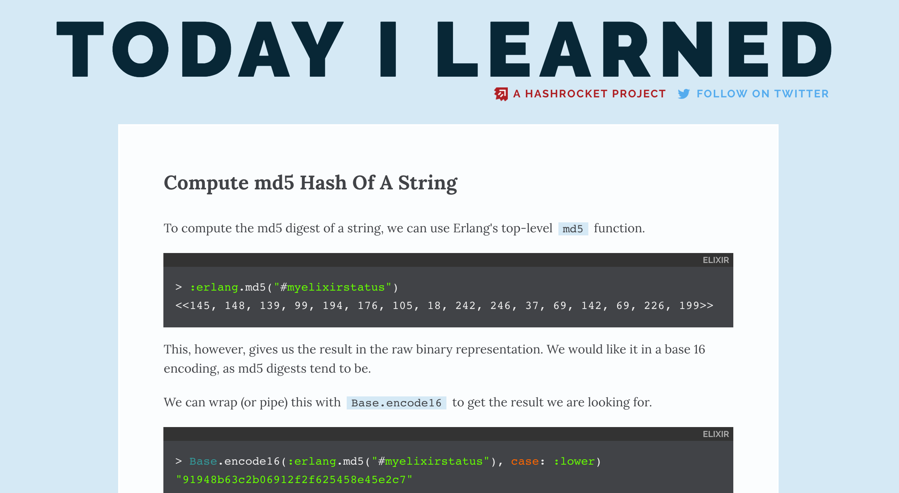
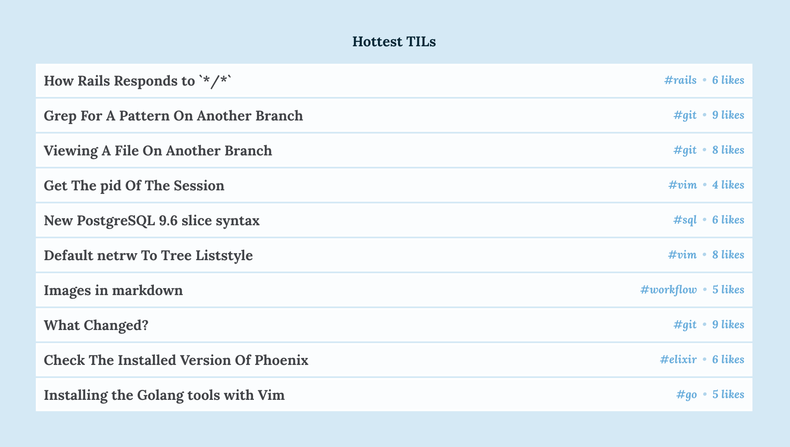

footer: Embrace the Database with Ecto (3/2/2017) - Josh Branchaud - @jbrancha - Hashrocket
slidenumbers: true

# _Embrace_ The _Database_

## with **Ecto**

---

# About me

- Josh Branchaud
- Software Developer at **Hashrocket**

---


hashrocket.com

^ I've been at Hashrocket over two years

^ We are Rails and PostgreSQL experts

^ Bringing expertise from Ruby world to Land of Elixir

^ Host Chicago's Elixir Meetup

---

###  I have some opinions about databases.

---

### Opinion 1:

### [fit] The **Database** Is Your

# *Friend*

^ It's my friend - assurances and makes me feel powerful

^ Now, you might say to me "but it is scary!"

---

### ... but databases are scary!

- Composite Indexes
- Full Outer Joins
- Common Table Expressions
- Explain Analyze Output

^ it's not a scary black box, or at least it doesn't have to be

^ we have these features for a reason, because ...

---

### Opinion 2:

### [fit] your database is not just a

### [fit] _dumb data store_

---

### Opinion 2:

### [fit] it is a _powerful_

### [fit] **computation engine**

^ lots of stuff we do inefficiently in our app logic can be better handled in the DB

^ e.g. organizing results and crunching data for reporting

---

### Opinion 3:

### What is _the single most important asset_ in the life of your product/business?

^ Idea? No

^ Source code? No

^ Data? Yes

---

### Opinion 3:

### The **data** stored in your _database_ is the single most important _asset_ in the life of your product/business.

^ We need to protect our data

^ make sure it is correct

---

### Opinion 4:

### [fit] The best database for web applications is

# `PostgreSQL`

^ Open-source, fast feature cycle

^ ACID-Compliant

^ Performant and scalable (100 millions rows on single node)

---

# Agenda

- Data Integrity
- Schemaless Queries
- Ecto's Escape Hatch
- Enhancing Ecto with Custom Functions

---

<!-- NOTES: but first, we need some data to work with -->

# Our Sample Data Source



---

# What is TIL?

TIL is an open-source project by the team at
[**Hashrocket**](https://hashrocket.com/) that catalogues the sharing &
accumulation of knowledge as it happens day-to-day. 

(Check it out - [til.hashrocket.com](til.hashrocket.com))

---

<!-- TODO: include a right-half image of a UML-type diagram -->

# TIL's DB Schema

- Posts
- Developers
- Channels

---

<!-- TODO: how do these code blocks of DDL description look? -->

# Posts Table

```sql
id           | integer
developer_id | integer
body         | text
channel_id   | integer
title        | character varying
likes        | integer

Foreign-key constraints:
    "fk_rails_447dc2e0a3" FOREIGN KEY (channel_id) REFERENCES channels(id)
    "fk_rails_b3ec63b3ac" FOREIGN KEY (developer_id) REFERENCES developers(id)
```

---

# Developers Table

```sql
 id             | integer
 email          | character varying
 username       | character varying

Referenced by:
    TABLE "posts" CONSTRAINT "fk_rails_b3ec63b3ac"
      FOREIGN KEY (developer_id) REFERENCES developers(id)
```

---

# Channels Table

```sql
 id              | integer
 name            | text

Referenced by:
    TABLE "posts" CONSTRAINT "fk_rails_447dc2e0a3"
      FOREIGN KEY (channel_id) REFERENCES channels(id)
```

---

# Database Full of Data

> So many answers just waiting to be asked the right question

^ TIL has been around for almost 2 years, good amount of data

^ Data is a pile of answers just waiting to be asked the right question

---

# Asking Questions

How do we ask questions of our data?

---

# We need a mediator

<!-- NOTE: good analogy here is that your database is a library and the
mediator between you and the library is a librarian. You can ask them
questions and they will help find things and figure it out. The duey decimal
system is analogous to databases indices. -->

What is the best mediator between us and our data?

<!-- NOTE: I'm here to tell you about the best DSL for interacting with a SQL database! -->

---

# SQL

SQL is the best way to talk to our SQL database

---

# How many posts are there?

```sql
sql> select count(id) from posts;
 count
-------
  1066
(1 row)
```

---

## What about

# **Elixir** and **Ecto**?

---

<!-- NOTES: this is an Elixir meetup, so we should probably talk about
Elixir and Ecto -->

# Ecto

> Ecto is a domain specific language for writing queries and interacting with databases in Elixir.

<!-- NOTES: also, Ecto is a really badass DSL for interacting with databases -->
<!-- NOTES: there is a lot we can accomplish from the comfort of the data-centric,
  functional accommodations that Elixir provides us. -->

---

### How many posts are there?

```elixir
iex> Repo.one(from p in "posts", select: count(p.id))
1066

17:16:36.573 [debug] QUERY OK source="posts" db=10.8ms queue=0.2ms
SELECT count(p0."id") FROM "posts" AS p0 []
```

---

## Queries Are Just

# Data

---

# Queries As Data

- #Ecto.Query Struct
- You build them up as you go
- You can inspect them

---

## Laying A Solid

# Foundation

### For Our Data

^ Before we go further, we want a strong foundation

^ without it, writing complex queries will be even harder

---

### [fit] Our *data* is only any good

### [fit] if it is **correct**

^ Incorrect or mismanaged data means our business suffers

^ It also means our user's experience suffers

^ If we are dealing with money, we are throwing money away

---

### We like putting data in our

## **database**

^ Our main app inserts and updates data
^ We write microservices to insert and update data
^ Our mobile apps insert and update data
^ People with production DB access

---

## Who makes sure we don't put bad data in our database?

---

# Validations, right?

App → `validations` → DB
Mobile → `validations` → DB
Services → `validations` → DB

^ Validation logic spread across 3 places

^ Does this make anyone uneasy? DRY it up!

---

### Your database is the ultimate

# **gatekeeper**

^ let your database make sure the data is right

---

### Database As The **Gatekeeper**

> "A database actively seeks to maintain the correctness of all its data."
-- Joe Celko

^ Joe wrote SQL For Smarties: Advanced SQL Programming, one of the best SQL
books you can get

^ We want our DB to maintain the integrity of the data

^ It does this with a variety of constraint mechanisms

<!--
You should be relying primarily on the database to validate your data.
Any application-level validations are for the application to do its job
(e.g. provide good validation errors, prevent unnecessary trips to DB,
etc.). You may have multiple application clients (phoenix, iphone, android)
that interface with your DB. DRY up the most essential layer of data
validation by putting it in your database.
-->

---

# [fit] Data Integrity

### Schemaless Queries

### Ecto's Escape Hatch

### Enhancing Ecto with Custom Functions

---

# Data Integrity - Data Types

Data types as constraints

```elixir
create table(:developers) do
  add :email, :varchar
  add :admin, :boolean
  add :created_at, :timestamp
end


```

---

# Data Integrity - Data Types

Using better, custom data types (e.g. uuid, bigint, and citext)

```elixir
execute("create extension if not exists citext;")

create table(:developers, primary_key: false) do
  add :id, :uuid, primary_key: true
  add :email, :citext
  add :admin, :boolean
  add :created_at, :timestamp
end


```

---

# Data Integrity - Not Null

Enforce Presence with Not Null Constraints

```elixir
create table(:developers, primary_key: false) do
  add :id, :uuid, primary_key: true
  add :email, :citext, null: false
  add :admin, :boolean, null: false
  add :created_at, :timestamp
end
```

---

# Data Integrity - Not Null

> The most important column constraint is the `NOT NULL`. Use this
> constraint automatically and then remove it only when you have good
> reason. This will help you avoid the complications of `NULL` values when
> you make queries against the data.
-- Joe Celko

---

# Data Integrity - Foreign Keys

Enforce Relationships with Foreign Key Constraints

```elixir
create table(:posts) do
  add :title, :varchar, null: false
  add :body, :text, null: false

  add :developer_id, references(:developers, type: :uuid)
end
 
 
 
 
```

---

# Data Integrity - Check Constraints

Enforce More General Relationships with Check Constraints

```elixir
create table(:posts) do
  add :title, :varchar, null: false
  add :body, :text, null: false
  add :likes, :smallint, null: false, default: 0

  add :developer_id, references(:developers, type: :uuid)
end

create constraint(:posts, "ensure_positive_likes", check: "likes >= 0")

```

---

### Data Integrity

# [fit] Schemaless Queries

### Ecto's Escape Hatch

### Enhancing Ecto with Custom Functions

---

# Schemaless Queries

```elixir
iex> Repo.one(from p in "posts", select: count(p.id))
1066
```

```elixir
iex> Repo.one(from p in MyApp.Posts, select: count(p.id))
1066
```

^ Always start with a `from` clause

^ `Repo.one`, `Repo.all`, etc. to execute

^ `import Ecto.Query` and `alias MyApp.Repo`

---

# So, why schemaless?

^ SQL is great for playing around with data, Elixir too

^ Allows for free-form, unconstrained query building

^ Dynamic queries, build up without creating schema first

^ When pattern emerges, create schema, not before

---

## Query Time

---

# [fit] How many developers are there?

---

# How many developers are there?

```elixir
iex> from(d in "developers",
     select: count(d.id))
     |> Repo.one()

17:19:01.195 [debug] QUERY OK source="developers" db=1.0ms queue=2.9ms
SELECT count(d0.id) FROM "developers" AS d0 []

32
```

^ We get metadata about the execute of the query

^ and the query produced by Ecto

^ So, what do we see in this simple query

---

## FROM Clause

> The `FROM` specifies one or more source tables for the `SELECT`.

^ Every query in Ecto starts with a FROM clause

^ this declares the source of the data we are interested in

## SELECT Clause

> `SELECT` retrieves rows from zero or more tables

^ In our case, with Ecto, from one or more tables

^ SQL always starts with SELECT

^ Ecto let's us start by thinking about source

---

# [fit] How many posts by channel?

---

# How many posts by channel?

## JOIN Clause

> A `JOIN` clause combines two `FROM` items

^ This question is about posts and channels

^ Let's join posts and channels

---

# How many posts by channel?

```elixir
iex> posts_and_channels =
       from(p in "posts",
       join: c in "channels",
       on: p.channel_id == c.id)
```

^ We can execute this partial query

^ but we can build on it

^ we bind it to posts_and_channels

---

# How many posts by channel?

##  GROUP BY Clause

> With `group by`, output is combined in groups of rows that match the grouping value

^ We want to group things in buckets based on channel

---

# How many posts by channel?

```elixir
iex> from([p,c] in posts_and_channels,
     group_by: c.name,
     select: c.name)
```

^ An important thing here

^ Our from uses a list because there are multiple sources

^ We group by name and select the name, results?

---

# How many posts by channel?

```elixir
iex> from([p,c] in posts_and_channels,
     group_by: c.name,
     select: c.name) |> Repo.all()

["clojure", "react", "rails", "vim", "workflow", "command-line", "sql",
 "elixir", "erlang", "design", "testing", "go", "mobile", "javascript",
 "devops", "ruby", "html-css", "git", "emberjs"]
```

^ This gives us our channel buckets

^ but we want a count of the posts in each bucket as well

---

# How many posts by channel?

## Aggregates

> Aggregate functions are computed across all rows making up each group, producing a separate value for each group.

^ GROUP BY is often paired with aggregates

^ this tells us something about the things in the bucket

^ in our case, we want to know the count of posts in each bucket

---

# How many posts by channel?

```elixir
iex> from([p,c] in posts_and_channels,
     group_by: c.name,
     select: {
       count(p.id),
       c.name
     }))
```

^ Anything not in the group by needs an aggregator

^ we use count to get the count of posts

^ Notice the struct

---

# How many posts by channel?

```elixir
iex> from([p,c] in posts_and_channels,
     group_by: c.name,
     select: {
       count(p.id),
       c.name
     }))
     |> Repo.all()

[{13, "clojure"}, {5, "react"}, {102, "rails"}, {201, "vim"}, {59, "workflow"},
 {110, "command-line"}, {121, "sql"}, {73, "elixir"}, {1, "erlang"},
 {6, "design"}, {28, "testing"}, {5, "go"}, {15, "mobile"}, {67, "javascript"},
 {32, "devops"}, {125, "ruby"}, {17, "html-css"}, {63, "git"}, {23, "emberjs"}]
```

^ great, we have the counts of each post

^ but these results are messy

^ let's order them

---

# How many posts by channel?

## ORDER BY Clause

> If the ORDER BY clause is specified, the returned rows are sorted in the specified order.

^ order by a row or by a computed value

^ order ascending or descending

^ Interesting note: there is no default ordering

^ the DB does whatever is fastest

---

# How many posts by channel?

```elixir
iex> from([p,c] in posts_and_channels,
     group_by: c.name,
     order_by: [desc: count(p.id)],
     select: {
       count(p.id),
       c.name
     }))
```

---

# How many posts by channel?

```elixir
iex> from([p,c] in posts_and_channels,
     group_by: c.name,
     order_by: [desc: count(p.id)],
     select: {
       count(p.id),
       c.name
     }))
     |> Repo.all()

[{201, "vim"}, {125, "ruby"}, {121, "sql"}, {110, "command-line"},
 {102, "rails"}, {73, "elixir"}, {67, "javascript"}, {63, "git"},
 {59, "workflow"}, {32, "devops"}, {28, "testing"}, {23, "emberjs"},
 {17, "html-css"}, {15, "mobile"}, {13, "clojure"}, {6, "design"}, {5, "go"},
 {5, "react"}, {1, "erlang"}]
```

^ Lots of Vim, Ruby, and SQL

^ there are 73 elixir posts

---

# [fit] How many posts on average per developer?

^ We just need to posts table

^ because it has a developer_id

---

# How many posts on average per developer?

```elixir
iex> post_counts =
       from(p in "posts",
       group_by: p.developer_id,
       select: %{
         post_count: count(p.id),
         developer_id: p.developer_id
       })
```

^ Most of this should be familiar

^ the posts table is our target

^ group_by developer_id 

^ select the developer_id and the count of posts

^ notice: we use a map this time

---

# How many posts on average per developer?

```elixir
iex> Repo.all(post_counts)

[%{developer_id: 14, post_count: 6}, %{developer_id: 25, post_count: 43},
 %{developer_id: 32, post_count: 1}, %{developer_id: 27, post_count: 2},
 %{developer_id: 8, post_count: 332}, %{developer_id: 17, post_count: 1},
 %{developer_id: 15, post_count: 23}, %{developer_id: 1, post_count: 1},
 %{developer_id: 10, post_count: 18}, %{developer_id: 26, post_count: 78},
 %{developer_id: 11, post_count: 15}, %{developer_id: 4, post_count: 130},
 %{developer_id: 18, post_count: 14}, %{developer_id: 30, post_count: 10},
 %{developer_id: 16, post_count: 3}, %{developer_id: 33, post_count: 1},
 %{developer_id: 6, post_count: 3}, %{developer_id: 19, post_count: 9},
 %{developer_id: 29, post_count: 82}, %{developer_id: 2, post_count: 236},
 %{developer_id: 23, post_count: 10}, %{developer_id: 31, post_count: 5},
 %{developer_id: 20, post_count: 8}, %{developer_id: 5, post_count: 3},
 %{developer_id: 13, post_count: 3}, %{developer_id: 22, post_count: 12},
 %{developer_id: 9, post_count: 10}, %{developer_id: 24, post_count: 4},
 %{developer_id: 7, post_count: 3}]
```

^ We have the posts for every developer

^ Now we need to average them

^ We can treat our query as a subquery

^ subquery is like creating an inline source/table

---

# How many posts on average per developer?

```elixir
iex> Repo.aggregate(subquery(post_counts), :avg, :post_count)

#Decimal<36.7586206896551724>
```

^ about 37 posts on average per developer

^ We can use Repo.aggregate instead of Repo.all to execute

^ We use :avg atom to get average

^ We are able to reference `:post_count` in our subquery because it is aliased

---

# Schemaless Queries

Let's try something a bit more complex

> What is the channel and title of each developer's most liked post in 2016?

---

# Complex Queries

Writing complex queries is all about
building the solution from the ground up

## piece by piece

---

### [fit] What is the _channel_ and _title_ of
### [fit] each developer's most liked post in 2016?

^ This involves channels, posts, and developers

^ we will need to join all three tables, let's start there

---

#### What is the channel and title of each developer's most liked post in 2016?

```elixir
iex> posts_devs_channels =
       from(p in "posts",
       join: d in "developers",
       on: d.id == p.developer_id,
       join: c in "channels",
       on: c.id == p.channel_id)
```

^ Now we have a partial query we can build on

^ Let's start by filtering the most liked to the top

---

#### What is the channel and title of each developer's most liked post in 2016?

```elixir
iex> top_of_2016 =
       from([posts, devs, channels] in posts_devs_channels,
       order_by: [desc: posts.likes],
       select: %{
         dev: devs.username,
         channel: channels.name,
         title: posts.title
       })
```

^ This is a good start, but we run into an issue

^ let's look at the result of this query so far

---

#### What is the channel and title of each developer's most liked post in 2016?

```elixir
iex> top_of_2016 |> Repo.all()

[%{channel: "javascript", dev: "developer16", title: "Because JavaScript"},
 %{channel: "vim", dev: "developer26",
   title: "Highlight #markdown fenced code syntax in #Vim"},
 %{channel: "command-line", dev: "developer26",
   title: "Homebrew is eating up your harddrive"},
 ...]
```

^ look closely, developer26 appears twice in first few results

^ we only want one result per developer

^ we don't need to resort to some complicated subquery or CTE

^ let's make sure our results are distinct by developer

---

#### What is the channel and title of each developer's most liked post in 2016?

## DISTINCT Clause

> If SELECT DISTINCT is specified, all duplicate rows are removed from the
> result set (one row is kept from each group of duplicates).

^ Great, this will allow DISTINCT ON the developer_id

---

#### What is the channel and title of each developer's most liked post in 2016?

```elixir
iex> top_of_2016 =
       from([posts, devs, channels] in posts_devs_channels,
       distinct: devs.id,
       order_by: [desc: posts.likes],
       select: %{
         dev: devs.username,
         channel: channels.name,
         title: posts.title
       })
```

^ for all results, only the first of each developer is kept

^ because we've ordered posts by most liked

^ each record that we keep will be the most liked for each developer

---

#### What is the channel and title of each developer's most liked post in 2016?

```elixir
posts.created_at > ^Ecto.DateTime.cast!({{2016,1,1},{0,0,0}}),
```

and

```elixir
posts.created_at < ^Ecto.DateTime.cast!({{2017,1,1},{0,0,0}}),
```

^ almost there, time to constrain to 2016

^ time to finally introduce the where clause

---

#### What is the channel and title of each developer's most liked post in 2016?

## WHERE Clause

> If the WHERE clause is specified, all rows that do not satisfy the condition are eliminated from the output.

---

#### What is the channel and title of each developer's most liked post in 2016?

```elixir
iex> top_of_2016 =
       from([posts, devs, channels] in posts_devs_channels(),
       distinct: devs.id,
       order_by: [desc: posts.likes],
       where: posts.created_at > ^Ecto.DateTime.cast!({{2016,1,1},{0,0,0}}),
       where: posts.created_at < ^Ecto.DateTime.cast!({{2017,1,1},{0,0,0}}),
       select: %{
         dev: devs.username,
         channel: channels.name,
         title: posts.title
       })
```

^ this will keep the results within the year of 2016

^ let's take a look at the output

---

#### What is the channel and title of each developer's most liked post in 2016?

```elixir
iex> top_of_2016 |> Repo.all()

[%{channel: "elixir", dev: "developer2",
   title: "Invoke Elixir Functions with Apply"},
 %{channel: "workflow", dev: "developer4", title: "Ternary shortcut in PHP"},
 %{channel: "vim", dev: "developer5",
   title: "Use colorcolumn to visualize maximum line length"},
 %{channel: "ruby", dev: "developer6",
   title: "Ruby optional arguments can come before required"},
 %{channel: "ruby", dev: "developer7",
   title: "Using pessimistic gem version to catch betas"},
 ...]
```

^ that's it, we built a fairly complex query from the ground up

^ we iterated on the solution until we had our answer

---

# Schemaless Query Functions in Ecto 2.0

- `Ecto.Repo.update_all/3`
- `Ecto.Repo.insert_all/3`
- `Ecto.Repo.delete_all/3`

^ other functions worth noting

---

### Data Integrity

### Schemaless Queries

# [fit] Ecto's Escape Hatch

### Enhancing Ecto with Custom Functions

---

# Escape Hatch

Ecto can't do it all, sometimes we need an **Escape Hatch**

---

# One-off Queries

Using `Ecto.Repo.query`

```elixir
iex> Repo.query("select * from generate_series(1,5);")

12:00:14.801 [debug] QUERY OK db=1.5ms
select * from generate_series(1,5); []
{:ok,
 %Postgrex.Result{columns: ["generate_series"], command: :select,
  connection_id: 59379, num_rows: 5, rows: [[1], [2], [3], [4], [5]]}}
```

^ for starters, we may just want to execute raw SQL

^ more interesting though, the `fragments` function

---

# Fragments

The `Ecto.Query.API.fragment` function

^ Allows us to inject SQL into Ecto queries

---

# Fragments in Queries

```elixir
iex> from(d in "developers",
     select: fragment("count(*)"))
     |> Repo.one()

17:19:01.195 [debug] QUERY OK source="developers" db=1.0ms queue=2.9ms
SELECT count(*) FROM "developers" AS d0 []

32
```

^ We can even give arguments to fragment

---

# Fragments in Queries

```elixir
iex> from(d in "developers",
     select: fragment("count(?)"), d.id)
     |> Repo.one()

17:19:01.195 [debug] QUERY OK source="developers" db=1.0ms queue=2.9ms
SELECT count(d0.id) FROM "developers" AS d0 []

32
```

^ let's put this new found tool to good use

^ let's revisit our query from before

---

# Fragments in Queries

```elixir
iex> top_of_2016 =
       from([posts, devs, channels] in posts_devs_channels(),
       distinct: devs.id,
       order_by: [desc: posts.likes],
       where: posts.created_at > ^Ecto.DateTime.cast!({{2016,1,1},{0,0,0}}),
       where: posts.created_at < ^Ecto.DateTime.cast!({{2017,1,1},{0,0,0}}),
       select: %{
         dev: devs.username,
         channel: channels.name,
         title: posts.title
       })
```

^ can we improve the where clause with a fragment?

^ I think we can better convey intent with Postgres's BETWEEN predicate

---

# Fragments in Queries

## BETWEEN predicate

> The BETWEEN predicate simplifies range tests

```
a between x and y
```

^ we want to say the created_at is between the beginning and end of 2016

^ let's write that fragment

---

# Fragments in Queries

```elixir
fragment("? between ? and ?",
  posts.created_at,
  ^Ecto.DateTime.cast!({{2016,1,1},{0,0,0}}),
  ^Ecto.DateTime.cast!({{2017,1,1},{0,0,0}})
)
```

^ this better conveys the intent of our where clause

---

# Fragments in Queries

```elixir
iex> top_of_2016 =
       from([posts, devs, channels] in posts_devs_channels(),
       distinct: devs.id,
       order_by: [desc: posts.likes],
       where: fragment("? between ? and ?",
                       posts.created_at,
                       ^Ecto.DateTime.cast!({{2016,1,1},{0,0,0}}),
                       ^Ecto.DateTime.cast!({{2017,1,1},{0,0,0}})
                     ),
       select: %{
         dev: devs.username,
         channel: channels.name,
         title: posts.title
       })
```

^ it's an improvement

^ makes good use of the fragment function

---

# Fragments in Migrations

```elixir
create table(:developers, primary_key: false) do
  add :id, :uuid, primary_key: true, default: fragment("gen_random_uuid()")
  add :email, :citext, null: false
  add :created_at, :timestamptz, null: false, default: fragment("now()")
  add :updated_at, :timestamptz, null: false, default: fragment("now()")
end
```

^ also can be used in migrations for default values

---

# One Step Further

From _clunky_ fragments to _elegant_ custom functions

^ condensing our where clause into the fragment was great

^ but we can do better

---

### Data Integrity

### Schemaless Queries

### Ecto's Escape Hatch

# [fit] Enhancing Ecto with
# [fit] Custom Functions

---

# Custom Functions

```elixir
fragment("? between ? and ?",
  posts.created_at,
  ^Ecto.DateTime.cast!({{2016,1,1},{0,0,0}}),
  ^Ecto.DateTime.cast!({{2017,1,1},{0,0,0}})
)
```

^ this is a common postgres feature

^ I bet we will reuse it

^ let's wrap it up as a custom function

---

# Custom Functions

```elixir
defmodule CustomFunctions do
  defmacro between(value, left_bound, right_bound) do
    quote do
      fragment("? between ? and ?",
               unquote(value),
               unquote(left_bound),
               unquote(right_bound))
    end
  end
end
```

^ CustomFunctions module provides reusable Ecto fragments

^ We create a macro

^ Check out Jason's talk for nitty-gritty details of macros

---

# Custom Functions

```elixir
iex> import CustomFunctions

iex> from([posts, devs, channels] in posts_devs_channels(),
     distinct: devs.id,
     order_by: [desc: posts.likes],
     where: between(posts.created_at,
                    ^Ecto.DateTime.cast!({{2016,1,1},{0,0,0}}),
                    ^Ecto.DateTime.cast!({{2017,1,1},{0,0,0}})
                  ),
     select: %{
       dev: devs.username,
       channel: channels.name,
       title: posts.title
     })
```

^ Here is our updated query

^ Even cleaner

^ Now we can easily use between wherever

---

# [fit] One more question to ask

^ Let's put everything together

^ and answer a final tricky question

---

# [fit] What are the hottest posts?

^ this is a TIL feature

---

# What are the hottest posts?



^ but how would we write the query with Ecto?

^ Well, how do we measure hotness?

---

# Measuring Hotness

with a HackerNews-esque Ranking Algorithm[^1]
<br/>

```
hotness_score = (likes / (age_in_hours ^ gravity))
```

[^1]: https://medium.com/hacking-and-gonzo/how-hacker-news-ranking-algorithm-works-1d9b0cf2c08d#.3sdij412h

^ play around with values, but 0.8 gravity is good for this app

---

# Measuring Hotness

with a HackerNews-esque Ranking Algorithm[^1]
<br/>

```
hotness_score = (likes / (age_in_hours ^ 0.8))
```

[^1]: https://medium.com/hacking-and-gonzo/how-hacker-news-ranking-algorithm-works-1d9b0cf2c08d#.3sdij412h

^ So, where do we start? Let's break this down and build it up piece by piece

^ Starting with age_in_hours

---

# What are the hottest posts?

```
age_in_hours = age_in_seconds / 3600
```

^ get hours if we can figure out seconds

---

# What are the hottest posts?

```
age_in_hours = age_in_seconds / 3600
```

```
age_in_seconds = (current_timestamp - published_at)
```

^ not quite, in postgres, this results in an interval of time

---

# What are the hottest posts?

```
age_in_hours = age_in_seconds / 3600
```

```
age_in_seconds = extract(epoch from
                   (current_timestamp - published_at))
```

^ extract with epoch keywords allows us to extract the

^ interval in terms of seconds

^ let's put it all together

---

# What are the hottest posts?

```
age_in_hours = extract(epoch from
                 (current_timestamp - published_at)
               ) / 3600
```

^ that gives us the age in hours

^ your fragment and custom function senses should be tingling

^ let's extract this

---

# What are the hottest posts?

How old is a post in hours?

```elixir
defmacro hours_since(timestamp) do
  quote do
    fragment(
      "extract(epoch from (current_timestamp - ?)) / 3600",
      unquote(timestamp)
    )
  end
end
```

^ we give this a name and can use it in our query

^ we can now try out hours_since

---

# What are the hottest posts?

```elixir
iex> posts_with_age_in_hours =
       from(p in "posts",
       select: %{
         id: p.id,
         hours_age: hours_since(p.published_at)
       })
```

^ this query contains familiar stuff

^ we can utilize hours_since 

^ and if we run this partial query

---

# What are the hottest posts?

```elixir
iex> posts_with_age_in_hours |> Repo.all()

[%{hours_age: 16176.589612136388, id: 12},
 %{hours_age: 8308.070006305556, id: 657},
 %{hours_age: 7713.880550556667, id: 708},
 %{hours_age: 6054.369684539444, id: 833},
 %{hours_age: 6768.798842247777, id: 772},
 %{hours_age: 8315.479890300556, id: 654},
 %{hours_age: 5698.932204395278, id: 870},
 ...]
```

^ this looks good, we have the age of each post

^ this doesn't make sense for unpublished posts, add a where

---

# What are the hottest posts?

```elixir
iex> posts_with_age_in_hours =
       from(p in "posts",
       where: not is_nil(p.published_at),
       select: %{
         id: p.id,
         hours_age: hours_since(p.published_at)
       })
```

^ Also, we don't want to deal with divide by 0 errors

^ If hours age is 0, let's use 0.1

---

# What are the hottest posts?

```elixir
defmacro greatest(value1, value2) do
  quote do
    fragment("greatest(?, ?)", unquote(value1), unquote(value2))
  end
end
```

^ Utilize postgres's `greatest` function

^ Let's add this to our query

---

# What are the hottest posts?

```elixir
iex> posts_with_age_in_hours =
       from(p in "posts",
       where: not is_nil(p.published_at),
       select: %{
         id: p.id,
         hours_age: greatest(hours_since(p.published_at), 0.1)
       })
```

^ with that out of the way, what's next?

^ we are going to need the number of likes for each post

^ let's add that in to the select

---

# What are the hottest posts?

```elixir
iex> posts_with_age_in_hours =
       from(p in "posts",
       where: not is_nil(p.published_at),
       select: %{
         id: p.id,
         likes: p.likes,
         hours_age: greatest(hours_since(p.published_at), 0.1)
       })
```

^ this is a good stopping point for this query

^ let's build out the next part of it, computing the hotness score

---

# What are the hottest posts?

```elixir
iex> hot_posts =
       from(p in subquery(posts_with_age_in_hours),
       select: %{
         id: p.id,
         hotness_score: fragment("? / (? ^ ?)",
                                 p.likes,
                                 p.hours_age,
                                 0.8)
       })
```

^ we have access to id, likes, and hours_age

^ use a fragment to compute the hotness_score

^ not quite there, we need to order them by score

---

# What are the hottest posts?

```elixir
iex> hot_posts =
       from(p in subquery(posts_with_age_in_hours),
       order_by: [desc: 2],
       select: %{
         id: p.id,
         hotness_score: fragment("? / (? ^ ?)",
                                 p.likes,
                                 p.hours_age,
                                 0.8)
       })
```

^ we utilize the ordinal form of order_by

^ references the second item in the select list

^ let's limit the results to just the top 5

---

# What are the hottest posts?

```elixir
iex> hot_posts =
       from(p in subquery(posts_with_age_in_hours),
       order_by: [desc: 2],
       select: %{
         id: p.id,
         hotness_score: fragment("? / (? ^ ?)",
                                 p.likes,
                                 p.hours_age,
                                 0.8)
       },
       limit: 5)
```

^ our query is ready to go, let's execute it

---

# What are the hottest posts?

```elixir
iex> hot_posts |> Repo.all()

[%{hotness_score: 0.07338486607688295, id: 1134},
 %{hotness_score: 0.0641696195616784, id: 1128},
 %{hotness_score: 0.06255221703215852, id: 1131},
 %{hotness_score: 0.05892805984356843, id: 1127},
 %{hotness_score: 0.056850664015716326, id: 1125}]
```

^ awesome it worked

^ in order to not leave you all in total suspense

^ let's fill out the query a bit more to see what the posts actually are

---

# What are the hottest posts?

```elixir
iex> hot_posts_with_titles =
       from(p in subquery(posts_with_age_in_hours),
       join: posts in "posts", on: posts.id == p.id,
       order_by: [desc: 2],
       select: %{
         title: posts.title,
         hotness_score: fragment("? / (? ^ ?)",
                                 p.likes,
                                 p.hours_age,
                                 0.8)
       },
       limit: 5)
```

^ join in the posts table with the post ids

^ swap the id out for the title

---

# What are the hottest posts?

```elixir
iex> hot_posts_with_titles |> Repo.all()

[%{hotness_score: 0.07335796393712307, title: "Custom loaders for webpack"},
 %{hotness_score: 0.06415573399947418, title: "Rerun Only Failures With RSpec"},
 %{hotness_score: 0.06253343464917116,
   title: "Rails on ruby 2.4: Silence Fixnum/Bignum warnings"},
 %{hotness_score: 0.05891816565837998, title: "Polymorphic Path Helpers"},
 %{hotness_score: 0.056841537315585514, title: "Clean untracked files in Git"}]
```

---

# That's It

---

### Sources and Links

- Joe Celko's SQL for Smarties: Advanced SQL Programming, 5th Edition

- PostgreSQL 9.6 Documentation

- https://til.hashrocket.com

---

# Thanks!

- Josh Branchaud
- Software Developer at **Hashrocket**
- Twitter: @jbrancha
- Github: @jbranchaud

^ I'd love to chat about postgres and Elixir

^ So, come find me in the halls between talks

^ My coworkers are here, chat with them as well
